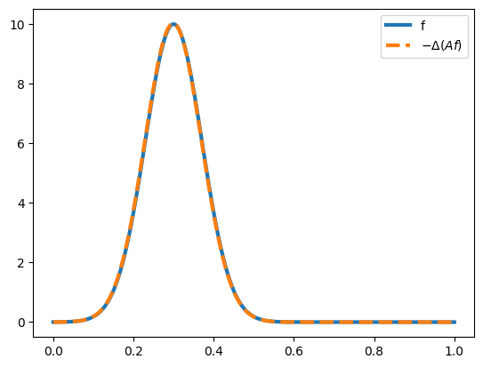

In this post i will tell you how to solve the 1D heat equation numerically in python using the spectral decomposition of the 1D laplacian.
The stationary heat equation will be solved as well as the evolution equation (homogeneous and inhomogeneous).
The focus here is on a basic numerical implementation and not on the underlying math.

The following topics are covered:

- [Stationary Heat Equation](#stationary-heat-equation)
- [Numerical Laplacian In One Dimension](#numerical-laplacian-in-one-dimension)
- [Time Evolution Of The Heat Equation](#time-evolution-of-the-heat-equation)
- [Numerical Time Derivative ](#numerical-time-derivative)
- [Inhomogeneous Evolution Equation](#inhomogeneous-evolution-equation)

The below code is meant to run in a jupyter notebook, but it can also easily be adapted to plain python.

# Stationary Heat Equation

The stationary heat equation is the equation 
$  \Delta u =-f $
on $L^2(0,1)$ with the domain $\mathrm{dom} \, \Delta = H^2 \cap H^1_0 $, where $\Delta$ is the self-adjoint laplacian ($u$ has two weak derivatives and $u(0)=u(1)=0$ for the continuous representant).

The negative inverse $A := -\Delta^{-1} : L^2 (0,1) \to \mathrm{dom} \, \Delta $ is a self-adjoint Hilbert-Schmidt operator.

The ONB of eigenfunctions of $A$ can be found as:
$$e_n(t) =  \sqrt{2} \sin( \pi n t ) $$
with eigenvalues
$$\lambda_n = \frac{1}{n^2 \pi^2}$$
and the Hilbert-Schmidt kernel $k$ is given by 
$$k =\sum_{n=1}^\infty  \lambda_n \overline{e}_n \otimes e_n. $$
Explicitly 
 $$ k(t,s)=    \sum_{n=1}^\infty  \frac{2}{ n^2\pi^2} \sin( \pi n t ) \sin( \pi n s ),$$
 where the convergence is even in $C[0,1]\times C[0,1]$.
So in total:
$$ (Af)(t) =  \int_0^1 k(t,s) f(s) ds$$
for all $f \in L^2(0,1)$.

The main idea for numeric computation is to simply truncate the series in the kernel at a finite number of terms:


```python
import numpy as np
from scipy import integrate
from matplotlib import pyplot as plt
from matplotlib.animation import FuncAnimation
from IPython.display import HTML

n_max = 100 #maximum number of terms in the series
```


```python
def f(x): #example function to be solved for
    return 10*np.exp(-(x-0.3)**2*100)
```


```python
def c(f,n):
    """Function to compute the n-th term in the expansion of f"""
    res, _ = integrate.quad(lambda s: f(s)*np.sin(n*np.pi*s),0,1)
    return res
```


```python
f_cns = [c(f,n) for n in range(1,n_max+1)] #expansion coefficients of f
```


```python
def A(t,cns):
    """The kernel applied to the function with expansion coefficients cns evaluated at t"""
    res = 0
    for n in range(1,len(cns)+1):
        res +=1/n**2*cns[n-1]*np.sin(n*np.pi*t)
    return 2*res/(np.pi**2)
```

# Numerical Laplacian In One Dimension

To check the above method for correctness a numeric version of the laplacian can be used:

For the 1D laplacian:
$$ \Delta u (x)= \frac{u(x-h)-2u(x)+u(x+h)}{h^2} + o(h^2).$$
Since
$$u(x+h)= u(x) + u^\prime (x) h + 1/2 \Delta u (x) h^2 + 1/6 u^{\prime \prime \prime} (x) h^3 + o(h^4)$$
from which it follows that 
$$ u(x-h)-2u(x)+u(x+h)  = \Delta u (x) h^2 + o(h^4).$$

Using this $\Delta u$ can be approximated by evaluating $u$ for points $x_0, \dots, x_n$ with $x_j = x_{j-1}+h$ for all $j$ and some fixed $h>0$ and then simply computing 
$$\Delta u (x_j)= \frac{u(x_{j-1})-2u(x_j)+u(x_{j+1})}{h^2} $$
for $j = 1, \dots , n-1$.

This is implemented in the following function:


```python
def laplacian(FX,h):
    """Evaluate the approximation the laplacian given function values in the array FX= [u(x_0), ... , u(x_n)] where the x_j are as above with distance h""" 
    out = np.zeros_like(FX)
    for i in range(1,len(FX)-1):
        out[i-1]= FX[i-1]-2*FX[i]+FX[i+1]
    out[0]=out[1]#simply duplicate the values at the boundary (makes sense by continuity)
    out[-1]=out[-2]
    return out/h**2
```

Now we can compare $f$ to $-\Delta (Af)$ (they should be equal):


```python
fig, ax = plt.subplots()

X = np.linspace(0,1,1000)
ax.plot(X,f(X), label ="f",lw=3)
ax.plot(X,-1*laplacian(A(X,f_cns),1/len(X)), label =r"$-\Delta (Af)$ ",lw=3,ls="--")
plt.legend()
```


    

    


# Time Evolution Of The Heat Equation

The problem is to find
$u \in C^1( [0, \infty) ; L^2(0,1) )$
so that $u(0)= u_0$ for a given $u_0 \in L^2(0,1)$ and so that $\dot{u}(t) =  \Delta u(t)$ for all $t \in [0 , \infty)$. The solution is given by $u(t)= e^{ \Delta t}u(0)$.

The $e_n$ from above form the spectral decomposition of $\Delta $ with eigenvalues $- 1/ \lambda_n = -n^2 \pi^2$ and so 
using the spectral theorem:
$$ u(t)= \sum_{n=1}^\infty e^{- n^2 \pi^2 t} e_n \langle e_n , u_0 \rangle =  \sum_{n=1}^\infty e^{- n^2 \pi^2 t} e_n \langle e_n , u_0 \rangle =\sqrt{2}  \sum_{n=1}^\infty  e^{- n^2 \pi^2 t} \int_0^1 \sin(n \pi s) u_0(s) ds \, e_n.$$


```python
def ut(t,x,cns):
    """Implementation of the above formula for u(t) where cns are the expansion coefficients of u_0"""
    res = 0
    for n in range(1,len(cns)+1):
        res +=np.exp(-n**2*np.pi**2*t)*cns[n-1]*np.sin(n*np.pi*x)
    return 2*res
```


```python
def u0(x): #example function as u_0
    return 0.8*np.exp(-(x-0.7)**2*100)
```


```python
u0_cns = [c(u0,n) for n in range(1,n_max+1)] #expansion coefficients of u_0
```

The evolution can be visualized using an animation. The heat simply dissipates as expected.


```python

X = np.linspace(0,1,1000)
T = np.linspace(0,0.5,100)

fig, ax = plt.subplots()
ln, = ax.plot([], [],label="$u(t)$")
plt.legend()
ax.set_xlim(0,1)
ax.set_ylim(0,1)
ax.set_xlabel("Position")
ax.set_ylabel("Temperature")

def update(frame):
    ln.set_data(X, ut(frame,X,u0_cns))
    return ln,

ani = FuncAnimation(fig, update, frames=T, blit=True)
HTML(ani.to_html5_video())
```

<video width="640" height="480" controls autoplay loop>
 <source type="video/mp4" src="../assets/heatfiles/anim1.mp4">
 </video>

# Numerical Time Derivative 

To verify the validity of the above solution the time derivative can be computed numerically as follows:
The (partial) time derivative satisfies
$$ \frac{\partial u}{\partial t}(t,x) = \frac{u(t+h,x) - u(t,x)}{h} + o(h) .$$

Which leads to a similar approximation as for the laplacian above: 


```python
def partial_t(FXY,h):
    tl = FXY.shape[0]
    out = np.zeros_like(FXY)
    for i in range(tl-1):
        out[i]= FXY[i+1]-FXY[i]
    out[-1]= out[-2]
    return out/h
```


```python
X = np.linspace(0,1,1000)
T = np.linspace(0,0.05,1000)
h = 0.05/len(T)
Ts, Xs = np.meshgrid(T, X,sparse = True)
Zs = ut(Ts,Xs,u0_cns)
```


```python
DUDT = partial_t(Zs.T,h)
```

Now $\Delta u (t)$ and $\frac{du}{dt}(t)$ can be compared to each other in another animation to check that they are truly equal:


```python
fig, ax = plt.subplots()
ln, = ax.plot([], [],lw=3,label=r"$\frac{du}{dt}(t)$")
ln2, = ax.plot([], [],ls="--",label=r"$\Delta u(t)$")

ax.set_xlim(0,1)
ax.set_ylim(-175,80)
ax.set_xlabel("Position")
plt.legend()

def update(frame):
    ln.set_data(X, DUDT[frame])
    ln2.set_data(X,laplacian(ut(T[frame],X,u0_cns),1/len(X)))
    return ln, ln2

ani = FuncAnimation(fig, update, frames=range(0,1000,10), blit=True)
HTML(ani.to_html5_video())
```
<video width="640" height="480" controls autoplay loop>
 <source type="video/mp4" src="../assets/heatfiles/anim2.mp4">
 </video>


# Inhomogeneous Evolution Equation

Consider now the problem
$\dot{u}(t) = \Delta u(t) + q(t)$ 
for $q \in C([0, \infty), L^2(0,1))$.

Then the solution is given by 
$$
u(t) = \exp(\Delta t) u(0) +\int_0^t \exp(\Delta (t-s))q(s)ds .
$$
With $q$ time independent:
$$ u(t) -\exp(\Delta t) u(0)  =  \int_0^t \sum_{n=1}^\infty e^{- n^2 \pi^2 (t-s)} e_n \langle e_n , q \rangle ds =\sum_{n=1}^\infty  \frac{1}{\pi^2 n^2}(1- e^{- n^2 \pi^2 t}) e_n \langle e_n , q \rangle $$


```python
def u_inhom(x,t,u0_cns,q_cns):
    """implementation of the formula for u(t) above"""
    ret = 0
    for n in range(1,len(q_cns)+1):
        ret+= 2/(n**2*np.pi**2)*q_cns[n-1]*(1-np.exp(-n**2*np.pi**2*t))*np.sin(n*np.pi*x)
    return ret+ut(t,x,u0_cns)
```

We can do an animation of the time evolution with $q=f$ and $u(0)$ as above. Notice how $u(t) \to A(f)$ as $t \to \infty$.


```python
X = np.linspace(0,1,1000)
T = np.linspace(0,0.25,100)

fig, ax = plt.subplots()
ln, = ax.plot([], [], label ="$u(t)$")
ax.plot(X,A(X,f_cns),label = "$A(f)$")
ax.set_xlim(0,1)
ax.set_ylim(0,1)
ax.set_xlabel("Position")
ax.set_ylabel("Temperature")
plt.legend()

def update(frame):
    ln.set_data(X, u_inhom(X,frame,u0_cns,f_cns))
    return ln,

ani = FuncAnimation(fig, update, frames=T, blit=True)
HTML(ani.to_html5_video())
```
<video width="640" height="480" controls autoplay loop>
 <source type="video/mp4" src="../assets/heatfiles/anim3.mp4">
 </video>

To verify the validity of the solution the same technique as before can be used:


```python
X = np.linspace(0,1,1000)
T = np.linspace(0,0.05,1000)
h = 0.05/len(T)
Ts, Xs = np.meshgrid(T, X,sparse = True)
Zs_inhom = u_inhom(Xs,Ts,u0_cns,f_cns)
DUDT_inhom = partial_t(Zs_inhom.T,h)
```


```python
fig, ax = plt.subplots()
ln, = ax.plot([], [],lw=3,label=r"$\frac{du}{dt}(t)$")
ln2, = ax.plot([], [],ls="--",label=r"$\Delta u(t) +q$")

ax.set_xlim(0,1)
ax.set_ylim(-175,80)
ax.set_xlabel("Position")
plt.legend()

def update(frame):
    ln.set_data(X, DUDT_inhom[frame])
    ln2.set_data(X,laplacian(u_inhom(X,T[frame],u0_cns,f_cns),1/len(X))+f(X))
    return ln, ln2

ani = FuncAnimation(fig, update, frames=range(0,1000,10), blit=True)
HTML(ani.to_html5_video())
```

<video width="640" height="480" controls autoplay loop>
 <source type="video/mp4" src="../assets/heatfiles/anim4.mp4">
 </video>
